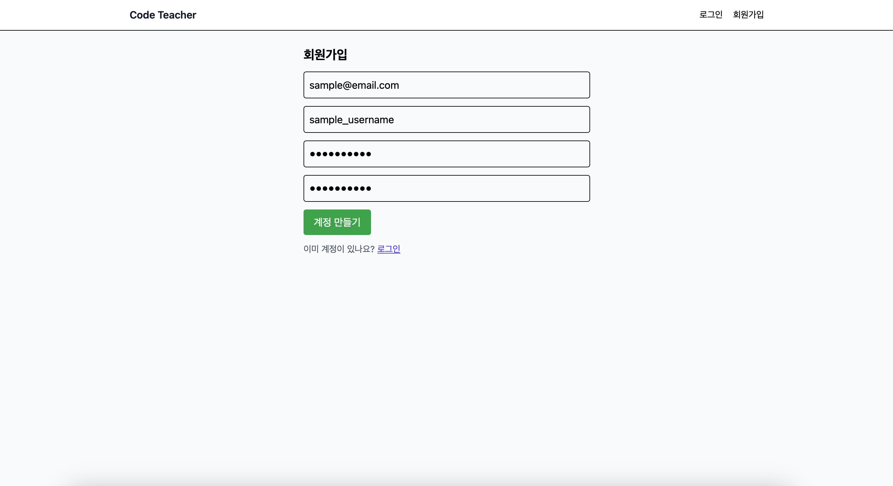
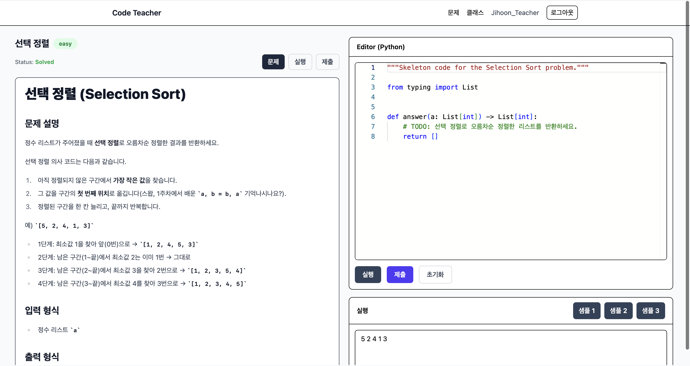
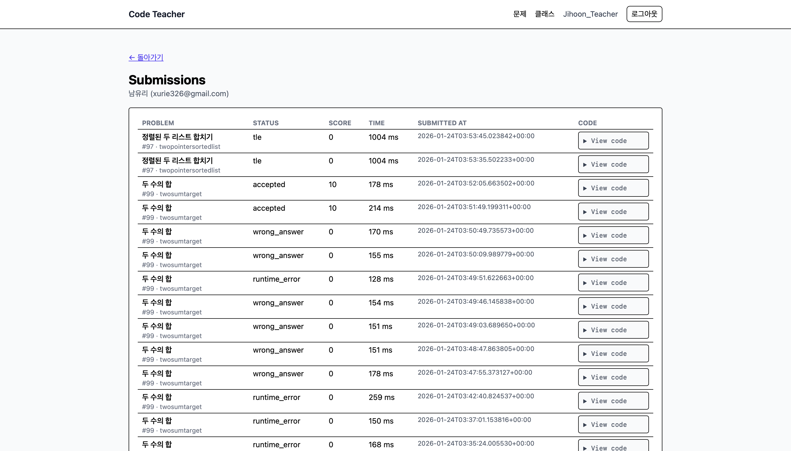
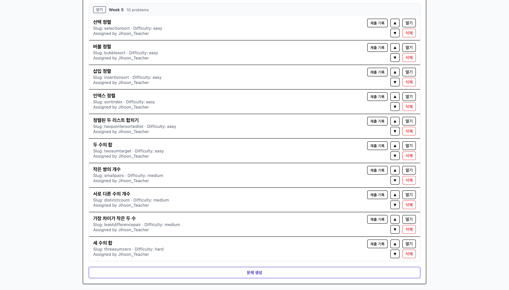

# Online Judge

## Table of Contents
0. Introduction
1. Service Overview
2. Environment Variables
3. Development/Deployment Workflow
4. systemd Management (Production)
5. DB Dump/Restore
6. Monitoring/Logs
7. NGINX / Cloudflare Flow

## 0. Introduction
- An online judge service where users solve programming problems and receive real-time grading results (separate frontend/backend/judge worker/DB).

## 1. Service Overview
- Components: Frontend (Next.js 16), Backend (FastAPI, Python), Worker (Python judge), DB (Azure PostgreSQL 17.7 while service, currently local PostgreSQL in VM)
- Ports: Backend 8000, Frontend 3000 (Dev: 8100/3100/55432)
- Routing: Browser → Cloudflare (HTTPS) → NGINX (443) → `/api` proxied to backend (8000), `/` proxied to frontend (3000).
- DB usage: Backend/worker both connect to Azure Postgres. Backend records submissions into `submissions` with status `queued`, worker polls the same table and updates `submission_results`/`submissions` (status, score, time).
- Worker trigger: No separate queue; worker container (`online_judge-worker`) runs continuously and periodically fetches new submissions.

## 2. Environment Variables
- `env/.env.prod`: Production (Azure DB, JWT, SMTP, `NEXT_PUBLIC_API_BASE=https://cotea.io/api`)
- `env/.env.dev`: Development (local DB container, port overrides 8100/3100/55432)
- `env/env.example`: Reference for key names  
> Do not commit secrets (.env.prod) to Git. Store them only on the server/secret store.

## 3. Development/Deployment Workflow
- Common: Manage code with Git → (optional) tag Docker images → run `docker compose` on server.
- Recommended tagging/restart policy: Fix image tags per service (`backend:1.0.0`, `frontend:1.0.0`, `worker:1.0.0`) and use those in compose. With `restart: always`, auto-restart/rollback becomes easier.
- Development example:
  1) `git pull`
  2) Run with local DB container: `docker compose -p oj-dev --env-file env/.env.dev up -d db backend worker frontend`
  3) Rebuild if needed after code changes: `docker compose -p oj-dev --env-file env/.env.dev build frontend backend`
  4) After testing: `git add/commit/push`
- Deployment example:
  1) `git pull` on server (or pull image tags)
  2) Use Azure DB, skip DB container: `docker compose -p oj-prod --env-file env/.env.prod up -d backend worker frontend --no-deps`
  3) Frontend is already built with prod API base (.env.prod)
- Schema change propagation (local → Azure):
  1) Apply migrations/DDL locally, then dump:  
     `PGPASSWORD="ojpass" pg_dump -Fc -h localhost -p 5432 -U oj -d oj > dump_host.pg`
  2) Restore to Azure (overwrite with caution): use the “DB Dump/Restore” procedure below
  3) Restart backend/worker if needed: `docker compose -p oj-prod --env-file .env.prod up -d backend worker frontend --no-deps`

## 4. systemd Management (Production)
- Unit: `/etc/systemd/system/online-judge.service`
- Run: `/usr/bin/docker compose -p oj-prod --env-file env/.env.prod up -d backend worker frontend --no-deps`
- Start/Stop:
  ```bash
  sudo systemctl start online-judge.service
  sudo systemctl stop online-judge.service
  sudo systemctl enable online-judge.service   # start on boot
  sudo systemctl disable online-judge.service
  sudo systemctl status online-judge.service
  ```

## 5. DB Dump/Restore (Example)
```bash
# Local DB -> dump
PGPASSWORD="ojpass" pg_dump -Fc -h localhost -p 5432 -U oj -d oj > dump_host.pg

# Restore to Azure (overwrite with caution)
docker run --rm \
  -e PGHOST=oj-prod.postgres.database.azure.com \
  -e PGPORT=5432 \
  -e PGUSER=oj \
  -e PGDATABASE=postgres \
  -e PGPASSWORD="(azure-pass)" \
  -e PGSSLMODE=require \
  -v "$PWD/dump_host.pg:/dump.pg:ro" \
  postgres:17 \
  pg_restore -h "$PGHOST" -p "$PGPORT" -U "$PGUSER" -d "$PGDATABASE" \
    --clean --if-exists --format=custom /dump.pg
```

## 6. Monitoring/Logs
- Live logs: `docker compose logs -f backend worker frontend`
- systemd logs (prod): `sudo journalctl -u online-judge -f` (or `-n 200`)
- Health: Temporary `/docs` or `/` curl; `/health` planned
- Status: `docker compose ps`, `docker ps`

## 7. NGINX / Cloudflare Flow
- Cloudflare: HTTPS proxy; origin is NGINX (server IP:443)
- NGINX routing:
  - `/api/` → `http://127.0.0.1:8000/` (prefix removed)
  - `/` → `http://127.0.0.1:3000`
- When building frontend with `NEXT_PUBLIC_API_BASE=https://cotea.io/api`, `/api/...` requests go to backend.
- In development (local): Access ports directly without Cloudflare/NGINX. Frontend 3100, backend 8100, local DB container 55432. Set API base to `http://localhost:8100`, etc.

## 8. Screenshots





## 9. Try It
- After signing up, go to Class → enter Code: `1GK14T` to join and start solving problems.
